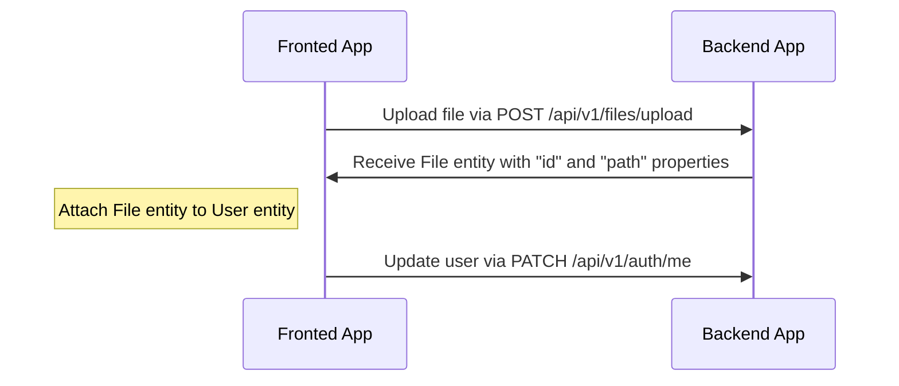
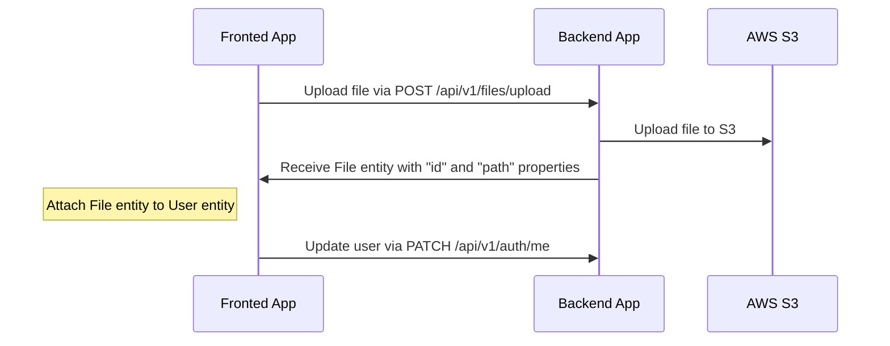
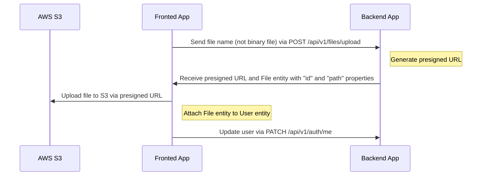

# File uploading

---

## Table of Contents <!-- omit in toc -->

- [Drivers support](#drivers-support)
- [Uploading and attach file flow for `local` driver](#uploading-and-attach-file-flow-for-local-driver)
  - [An example of uploading an avatar to a user profile (local)](#an-example-of-uploading-an-avatar-to-a-user-profile-local)
  - [Video example](#video-example)
- [Uploading and attach file flow for `s3` driver](#uploading-and-attach-file-flow-for-s3-driver)
  - [Configuration for `s3` driver](#configuration-for-s3-driver)
  - [An example of uploading an avatar to a user profile (S3)](#an-example-of-uploading-an-avatar-to-a-user-profile-s3)
- [Uploading and attach file flow for `s3-presigned` driver](#uploading-and-attach-file-flow-for-s3-presigned-driver)
  - [Configuration for `s3-presigned` driver](#configuration-for-s3-presigned-driver)
  - [An example of uploading an avatar to a user profile (S3 Presigned URL)](#an-example-of-uploading-an-avatar-to-a-user-profile-s3-presigned-url)
- [How to delete files?](#how-to-delete-files)

---

## Drivers support

The API supports the following drivers out of the box: `local`, `s3`, and `s3-presigned`. Configure them via the `FILE_DRIVER` environment variable. Extend the `files` module if you need a different storage backend.

> For production we recommend using the `s3-presigned` driver to offload uploads to S3 directly.

---

## Uploading and attach file flow for `local` driver

Endpoint `/api/v1/files/upload` accepts multipart uploads and returns a `File` entity with `id` and `path`. Attach that id to other resources (e.g., user avatar).

### An example of uploading an avatar to a user profile (local)



## Uploading and attach file flow for `s3` driver

With the `s3` driver, the API streams the file to S3 and then returns the stored metadata.

### Configuration for `s3` driver

1. Create an S3 bucket.
2. Add a permissive CORS config while developing:

    ```json
    [
      {
        "AllowedHeaders": ["*"],
        "AllowedMethods": ["GET"],
        "AllowedOrigins": ["*"],
        "ExposeHeaders": []
      }
    ]
    ```

3. Provide environment variables:

   ```dotenv
   FILE_DRIVER=s3
   ACCESS_KEY_ID=YOUR_ACCESS_KEY_ID
   SECRET_ACCESS_KEY=YOUR_SECRET_ACCESS_KEY
   AWS_S3_REGION=YOUR_AWS_S3_REGION
   AWS_DEFAULT_S3_BUCKET=YOUR_AWS_DEFAULT_S3_BUCKET
   ```

### An example of uploading an avatar to a user profile (S3)



## Uploading and attach file flow for `s3-presigned` driver

For `s3-presigned`, the API issues a pre-signed URL instead of receiving the binary payload. Clients upload directly to S3 and then associate the resulting `File` record.

### Configuration for `s3-presigned` driver

1. Create an S3 bucket and configure CORS:

    ```json
    [
      {
        "AllowedHeaders": ["*"],
        "AllowedMethods": ["GET", "PUT"],
        "AllowedOrigins": ["*"],
        "ExposeHeaders": []
      }
    ]
    ```

   For production, restrict origins to your domain.

2. Set environment variables:

   ```dotenv
   FILE_DRIVER=s3-presigned
   ACCESS_KEY_ID=YOUR_ACCESS_KEY_ID
   SECRET_ACCESS_KEY=YOUR_SECRET_ACCESS_KEY
   AWS_S3_REGION=YOUR_AWS_S3_REGION
   AWS_DEFAULT_S3_BUCKET=YOUR_AWS_DEFAULT_S3_BUCKET
   ```

### An example of uploading an avatar to a user profile (S3 Presigned URL)



## How to delete files?

Files are retained to avoid losing historical context. If you need automated cleanup, create a scheduled job that removes objects from storage and disables associated records.

---

Previous: [Serialization](serialization.md)

Next: [Tests](tests.md)
